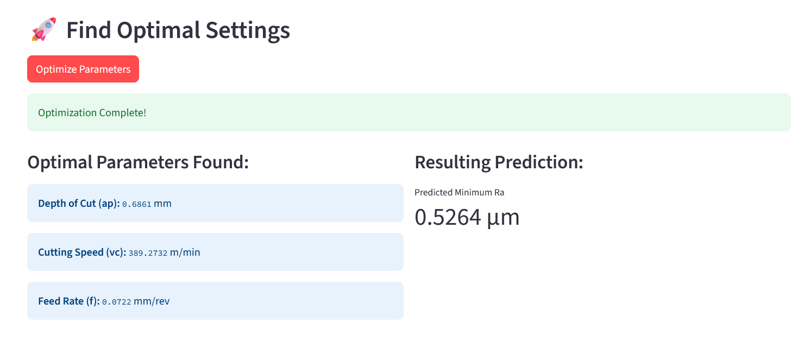

# ⚙️ AI-Powered Machining Process Optimization

This project presents an end-to-end machine learning pipeline to predict and optimize surface roughness ($Ra$) in micromachining processes. A predictive model is trained on experimental data, which is then used by a genetic algorithm to find the optimal machining parameters to achieve the smoothest possible surface finish. The entire solution is deployed as an interactive web application using Streamlit.




---
## 🚀 Key Features

* **End-to-End ML Pipeline:** Covers the complete workflow from data ingestion and cleaning to model deployment and optimization.
* **Accurate Prediction:** Utilizes a Gradient Boosting Regressor to predict surface roughness ($Ra$) with a high degree of accuracy (**R² score of ~0.97**).
* **Process Optimization:** Implements a **Genetic Algorithm (Differential Evolution)** to find the optimal values for key machining parameters (`ap`, `vc`, `f`) that minimize the predicted $Ra$.
* **Model Comparison:** Evaluates and compares multiple regression models (Random Forest, SVR, Gradient Boosting) to select the best performer.
* **Interactive Web Application:** A user-friendly interface built with **Streamlit** that allows for real-time prediction and on-demand optimization.

---
## 🛠️ Tech Stack

* **Language:** Python
* **Data Manipulation:** Pandas, NumPy
* **Machine Learning:** Scikit-learn
* **Optimization:** SciPy
* **Web Framework:** Streamlit
* **Data Visualization:** Matplotlib, Seaborn

---
## 📂 Repository Structure
The project is organized into a clean and modular structure for clarity and scalability.  

```bash
surface-roughness-optimizer/
├── artifacts/
│   ├── best_model.pkl
│   └── scaler.pkl
├── data/
│   ├── Exp1.csv
│   ├── Exp2.csv
│   └── Prep.csv
├── notebooks/
│   └── surface_roughness_estimation.ipynb
├── graphs/
│   └── surface_roughness.png
├── .gitignore
├── app.py
├── README.md
└── requirements.txt
```


## ⚙️ Installation & Setup

To run this project locally, please follow these steps.

### 1. Clone the Repository
```bash
git clone [https://github.com/your-username/surface-roughness-optimizer.git](https://github.com/your-username/surface-roughness-optimizer.git)
cd surface-roughness-optimizer

2. Create a Virtual Environment (Recommended)
# For Windows
python -m venv venv
venv\Scripts\activate

# For macOS/Linux
python3 -m venv venv
source venv/bin/activate

3. Install Dependencies
Install all the required Python libraries using the requirements.txt file.
pip install -r requirements.txt


🏃 How to Run the Application
The application script is designed to be self-contained. The first time it runs, it will automatically train the model and save the necessary artifacts.

Navigate to the project's root directory in your terminal.

Launch the Streamlit application with the following command:
streamlit run app.py

Using the App
Real-time Prediction: Use the sliders in the left sidebar to adjust the 8 input machining parameters. The predicted Ra will update instantly.

Optimization: After setting the desired fixed parameters (like cutting forces), click the "Optimize Parameters" button. The genetic algorithm will run and display the recommended settings for ap, vc, and f that yield the lowest possible Ra


Of course. Here is the content formatted for a README.md file. You can copy and paste this directly into the README.md file in your GitHub repository.

Markdown

# ⚙️ AI-Powered Machining Process Optimization

This project presents an end-to-end machine learning pipeline to predict and optimize surface roughness ($Ra$) in micromachining processes. A predictive model is trained on experimental data, which is then used by a genetic algorithm to find the optimal machining parameters to achieve the smoothest possible surface finish. The entire solution is deployed as an interactive web application using Streamlit.


*(**Note:** You should replace the link above with a screenshot or a GIF of your running application.)*

---
## 🚀 Key Features

* **End-to-End ML Pipeline:** Covers the complete workflow from data ingestion and cleaning to model deployment and optimization.
* **Accurate Prediction:** Utilizes a Gradient Boosting Regressor to predict surface roughness ($Ra$) with a high degree of accuracy (**R² score of ~0.97**).
* **Process Optimization:** Implements a **Genetic Algorithm (Differential Evolution)** to find the optimal values for key machining parameters (`ap`, `vc`, `f`) that minimize the predicted $Ra$.
* **Model Comparison:** Evaluates and compares multiple regression models (Random Forest, SVR, Gradient Boosting) to select the best performer.
* **Interactive Web Application:** A user-friendly interface built with **Streamlit** that allows for real-time prediction and on-demand optimization.

---
## 🛠️ Tech Stack

* **Language:** Python
* **Data Manipulation:** Pandas, NumPy
* **Machine Learning:** Scikit-learn
* **Optimization:** SciPy
* **Web Framework:** Streamlit
* **Data Visualization:** Matplotlib, Seaborn

---
## ⚙️ Installation & Setup

To run this project locally, please follow these steps.

### 1. Clone the Repository
```bash
git clone [https://github.com/your-username/surface-roughness-optimizer.git](https://github.com/your-username/surface-roughness-optimizer.git)
cd surface-roughness-optimizer
2. Create a Virtual Environment (Recommended)
It's a best practice to create a virtual environment to manage project dependencies.

Bash

# For Windows
python -m venv venv
venv\Scripts\activate

# For macOS/Linux
python3 -m venv venv
source venv/bin/activate
3. Install Dependencies
Install all the required Python libraries using the requirements.txt file.

Bash

pip install -r requirements.txt
🏃 How to Run the Application
The application script is designed to be self-contained. The first time it runs, it will automatically train the model and save the necessary artifacts.

Navigate to the project's root directory in your terminal.

Launch the Streamlit application with the following command:

Bash

streamlit run app.py
Your web browser will open a new tab with the interactive application.

Using the App
Real-time Prediction: Use the sliders in the left sidebar to adjust the 8 input machining parameters. The predicted Ra will update instantly.

Optimization: After setting the desired fixed parameters (like cutting forces), click the "Optimize Parameters" button. The genetic algorithm will run and display the recommended settings for ap, vc, and f that yield the lowest possible Ra.

📊 Workflow & Methodology
Data Preprocessing: Three experimental datasets (.csv) are loaded, cleaned, and merged. Features and the target variable (Ra) are identified.

Exploratory Data Analysis (EDA): A correlation heatmap and distribution plots are used to understand the relationships between different machining parameters.

Model Training & Tuning:

The data is preprocessed using StandardScaler and split into training and testing sets.

Three models (Random Forest, Gradient Boosting, SVR) are trained and tuned using GridSearchCV to find the best hyperparameters.

The Gradient Boosting model was selected as the best performer based on its high R 
2
  score and low error metrics.

Optimization:

The trained Gradient Boosting model serves as the objective function for the differential_evolution genetic algorithm.

The algorithm intelligently searches the parameter space for ap (depth of cut), vc (cutting speed), and f (feed rate) to find the combination that minimizes the predicted Ra.
